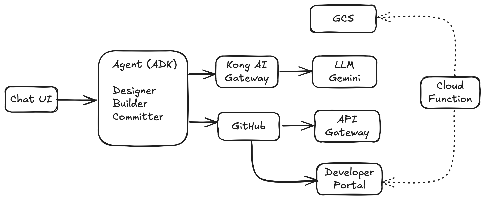

# GenAPI: Design, Deploy, and Publish APIs with AI

GenAPI empowers you to design, deploy, and publish APIs effortlessly, even without extensive coding knowledge or expertise in diverse technologies. This agentic AI solution guides you through the entire API lifecycle using natural language interactions.

[Working Demo](https://youtu.be/r9fUBc_rZDY)

## Features

*   **AI-Powered API Design:**  Describe your API requirements in natural language and let the agent generate the OpenAPI specification.
*   **Automated Deployment:**  Seamlessly deploy your API to Kong Gateway through an automated pipeline.
*   **Security Configuration:**  Easily configure API security using API Key or OAuth2.0 schemes.
*   **Declarative Configuration:**  Generates Kong declarative configuration for easy management.
*   **Developer Portal Publishing:**  Automatically publish your API specification to a developer portal.
*   **CI/CD Integration:**  Enable continuous delivery through GitHub integration.

## System Design

This diagram illustrates the GenAPI system architecture:

**TODO** : Add a RAG with specs in GCS to generate organization based spec standards. Currently blocked since I cannot use Kong RAG Injector with redis

## Steps for generating artifacts

1. Access the [GenAPI](https://genapi.apiprimer.com)
2. This will start a session with the genapi agent running on cloud run
3. First prompt would be to start with `new api` or `existing api`
    - **For New API**: You can start by describing your api entity or the different methods it should involve or give a json for request or response. 
    - **For existing API**: Copy the YML spec as the input and perform some modifications (upload functionality is not available right now)
4. You will have chance to iterate over the spec before finalizing and going to next step
5. Provide the backend URL for the API
6. Select the security scheme for the API, for best practice currently it support API Key or OAuth2.0
7. Once its completed, the agent will now take over and start generating the openapi.yml and kong declarative yml and the insomnia json project that you can import into in the tool (starter project)
8. It will ask you whether you want to commit this into a repository, confirm this if you want to deploy this API and publish the spec. 
9. Once deployed, you can make tweaks in the configuration or spec from the github to provide continuous delivery.
10. Finally, the pipeline in GitHub gets triggered which deploys your API into Kong Gateway and publish the spec in the [developer portal](https://developer.apiprimer.com)

## Code

Explore the source code on the [develop](https://github.com/spjohn85/genapi/tree/develop) branch.
